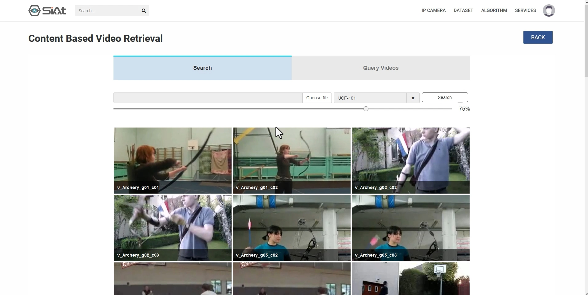
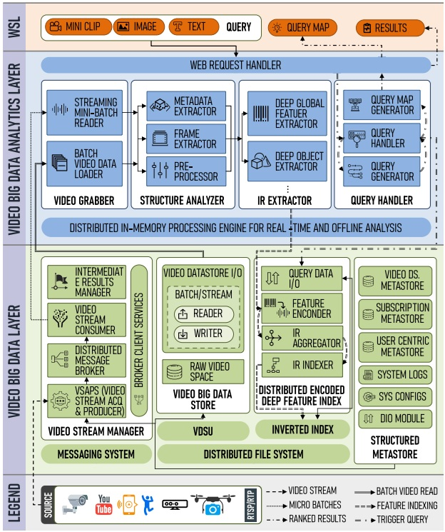
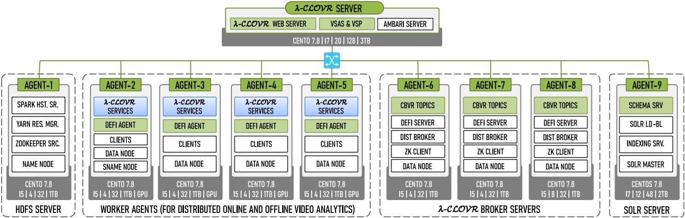
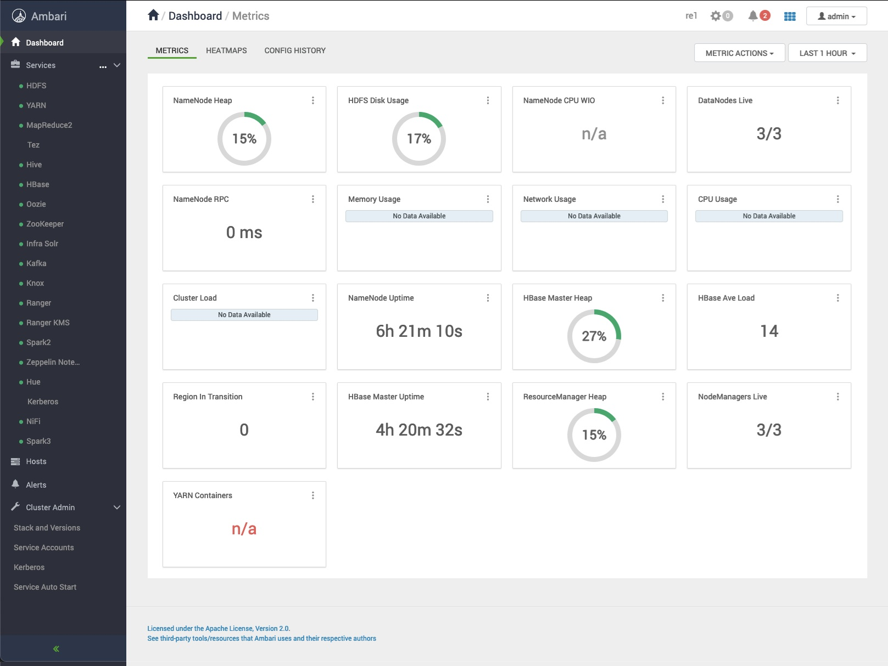

# **λ-CLOVR**: Looking for a Needle in a Haystack: A Content-Based Video Big Data Retrieval System in the Cloud

[Watch the demo](http://demo.dkelab.kr/)
[](http://demo.dkelab.kr/demo.html)

The enormous amounts of video data from CCTV, drones, smartphones, and streaming platforms demands retrieval systems that can scale well beyond traditional, single-machine designs. λ-CLOVR—a scalable, distributed content-based video retrieval (CBVR) system—addresses this need by combining a distributed, cloud-native technology stack with the principles of lambda architecture. It offers a single framework for near real-time stream processing and large-scale offline analytics, unifying two workloads that require separate pipelines.

At its core, λ-CLOVR relies on Kafka to ingest and buffer millions of frames per second, Spark to perform in-memory structural analysis and feature extraction, SolrCloud to index deep visual embeddings, and HDFS/HBase for durable storage and rich metadata management. A domain-specific data abstraction, VidRDD, hides the complexities of video analytics inside Spark, while the Distributed Encoded Deep Feature Indexer (DEFI) converts high-dimensional CNN features into compact representations suitable for efficientt indexing.

λ-CLOVR is has pluggable architecture. Researchers can register new deep-learning models, developers can create custom analytics services, and operators can scale any subsystem—ingestion, analytics, or indexing—without touching client code. The platform already supports multimodal querying by text, image, and clip and has been benchmarked on YouTube-8M, Sports-1M, and V3C1.

The system is deployed on an eight-node Hortonworks Data Platform (HDP) cluster, but the design is portable to any Hadoop-compatible environment. All services ship as micro-services coordinated by Ambari, making upgrades deterministic and rollback-friendly. Extensive JavaDocs document every API endpoint and service method, ensuring the codebase is both discoverable and extensible.

λ-CLOVR's architecture, detailed below, offers a template for future video-analytics frameworks—one that balances robust engineering with research flexibility.


# Architecture

The following figure presents the λ-CLOVR stack, divided into three cooperative layers: the Video Big Data Layer (VBDL), the Video Big Data Analytics Layer (VBDAL), and the Web Service Layer (WSL).





The **Video Big Data Layer (VBDL)** orchestrates the ingestion, persistence, and indexing of video big data. Its Video Stream Manager acquires feeds from heterogeneous sources; the Video Stream Acquisition and Producer Service (VSAPS) decodes and mini-batches frames, serializes them as JSON, compresses them with Snappy, and publishes them to partitioned Kafka topics. A dynamic brokerage subsystem oversees topic creation, partition allocation, and a replication factor of three to maintain fault tolerance. The Video Big Data Store persists raw streams as Video Data Stream Units (VDSUs). Finally, DEFI converts VGG-19 and YOLO features into logarithmically quantized encodings, aggregates spatial, object, and textual descriptors, and stores them in a sharded SolrCloud index.

The **Video Big Data Analytics Layer (VBDAL)** performs distributed processing on both live streams and offline video data. The VidRDD abstraction automates and handles the video analytics in a fault-tolerant manner. The Video Grabber converts Kafka mini-batches and HDFS video files into VidRDDs. The Structure Analyzer then parses formats, extracts keyframes, and applies preprocessing—normalization, histogram equalisation, gamma correction, and background subtraction—to standardise inputs. Feature extraction follows: a Deep Global Feature Extractor computes holistic embeddings with VGG-19, while an Object Extractor identifies entity-level regions with YOLOv3. Results are cached in FeatureRDDs, encoded by DEFI, and indexed for future queries.

The **Web Service Layer (WSL)** offers a role-aware REST interface. An API gateway authenticates users, manages sessions, and routes requests to the correct micro-services. Three principal roles—Admin, Developer, and Consumer—control access to stream registration, service creation, or pure retrieval tasks. Endpoints are annotated with Swagger; the `SwaggerConfigurationServlet` therefore exposes live, interactive documentation. All operations are stateless and token-based, permitting horizontal scaling of the gateway. Optional Web-Socket channels push asynchronous notifications—such as alert triggers or indexing milestones—to subscribed clients.

This layered structure isolates concerns: VBDL guarantees durable, low-level data operations; VBDAL delivers compute-intensive analytics; and WSL exposes a clean, versioned interface.


# System Requirements

- **Operating System:** CentOS or RHEL 7+  
- **Java:** OpenJDK 8+  
- **Python:** 3.6+ 
- **Apache Spark:** 2.3+
- **Apache Kafka:** 2.0+
- **Apache Hadoop:** 3.1+  
- **Apache Hive:** 3.1+  
- **Apache HBase:** 2.1+  
- **Apache Zookeeper:** 3.4+  
- **Apache Solr:** 8.11+  
- **Big Data Cluster Stack:** Hortonworks Data Platform (HDP) 3.1.5+ with Ambari


# Cluster Setup

The deployment runs on eight HDP nodes. A dedicated λ-CLOVR Server hosts the REST gateway, VSAPS, and the Ambari console, acting as the primary ingress for both user traffic and device registration. A separate HDFS master node combines the NameNode, Spark History Server, YARN ResourceManager, and part of the Zookeeper quorum to orchestrate data locality and job scheduling. Four homogeneous worker nodes provide GPU and storage to the analytics pipeline; they execute Spark tasks, consume Kafka streams, encode features, and operate as HDFS DataNodes. Three broker nodes form a resilient Kafka cluster that buffers both raw frames and encoded intermediate results with a replication factor of three, ensuring no data loss during maintenance or failure. Finally, a utility node runs SolrCloud for DEFI's index and stores the HBase-backed Structured Metastore. This separation avoids JVM contention, simplifies upgrades, and allows each subsystem to scale horizontally.



HDP cluster installation instructions can be found here: [https://www.ibm.com/docs/en/storage-scale-bda?topic=installation-create-hdp-cluster](https://www.ibm.com/docs/en/storage-scale-bda?topic=installation-create-hdp-cluster)




## Cluster Configuration

These `Cluster Configurations` directory provides Ambari-managed configs. Cluster-wide changes, such as altering HDFS block size or Kafka replication factors, should be made through Ambari. Local overrides—like adjusting `spark.executor.memory` can be set in `SPARK2_CLIENT/spark-defaults.conf` and `SPARK2_CLIENT/spark-env.sh`. Device-specific ingestion settings (frame rate, resolution, protocol) are stored in the Video Data Source Metastore.

```
Cluster Configurations
├───ACCUMULO_CLIENT          # Configuration for Accumulo, a sorted, distributed key/value store built on Hadoop.
├───ATLAS_CLIENT             # Metadata management and data governance support via Apache Atlas.
├───BASH_COMPLETION.D_CLIENT # Shell completion scripts for CLI tools to improve user experience.
├───DEFAULT                  # Default system-wide Hadoop and ecosystem configurations.
├───DRUID_CLIENT             # Real-time analytics and ingestion settings for Apache Druid.
├───HBASE_CLIENT             # Configuration for HBase metadata and intermediate result storage.
├───HDFS_CLIENT              # Hadoop settings for distributed video storage.
├───HIVE-HCATALOG_CLIENT     # HCatalog support for shared metadata across Hadoop tools.
├───HIVE_CLIENT              # Metadata query and storage support for structured information.
├───KAFKA_CLIENT             # Messaging system configuration for real-time streaming pipelines.
├───KNOX_CLIENT              # Gateway access and security configuration for Hadoop REST APIs.
├───LIVY2_CLIENT             # REST server configuration for submitting Spark jobs remotely.
├───MAPREDUCE2_CLIENT        # Supports batch processing tasks within VBDAL.
├───OOZIE_CLIENT             # Workflow scheduler settings for Hadoop jobs coordination.
├───PHOENIX_CLIENT           # SQL layer support over HBase for low-latency queries.
├───PIG_CLIENT               # Scripting platform configurations for analyzing large data sets.
├───RANGER_CLIENT            # Security policy administration for data access control.
├───SECURITY_CLIENT          # General security and Kerberos authentication settings.
├───SPARK2_CLIENT            # In-memory video analytics, VidRDD-based processing.
├───SQOOP_CLIENT             # Import/export configurations for moving data between Hadoop and RDBMS.
├───STORM_CLIENT             # Real-time distributed computation settings for streaming data.
├───TEZ_CLIENT               # DAG engine parameters for Hive.
├───YARN_CLIENT              # Capacity scheduler, container rules, resource management for distributed jobs.
├───ZEPPELIN_CLIENT          # Notebook-based interactive data analytics configuration.
└───ZOOKEEPER_CLIENT         # Coordination for Kafka and HBase clusters, quorum and logging settings.
```

<br/>

> [!IMPORTANT]  
> The code and documentation here are provided for confidential evaluation only and may not be redistributed.


# Getting Started

- Install Hortonworks HDP 3.1.5+ with Hadoop, Spark, Kafka, Zookeeper, HBase, Hive, and Solr.
- Clone this repository on the λ-CLOVR Server node and build it: `mvn clean package`.
- Deploy cluster configurations through Ambari.
- Deploy all services via Ambari on HDP cluster.
- Build Artifacts and upload Uber-JAR's to HDFS.
- Configure and launch Kafka topics for stream ingestion.
- Start λ-CLOVR web service and REST APIs.
- Submit video streams or batch video datasets for indexing.
